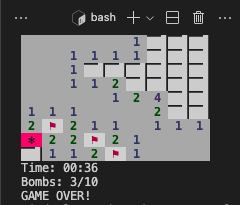
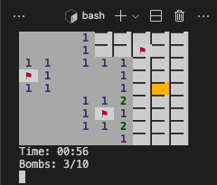
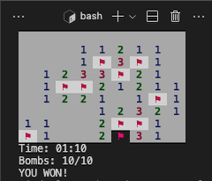

# minesweeper
<!--


-->
].lines&url=https://api.codetabs.com/v1/loc/?github=Alessandro1918/minesweeper)
].linesOfCode&url=https://api.codetabs.com/v1/loc/?github=Alessandro1918/minesweeper)
].comments&url=https://api.codetabs.com/v1/loc/?github=Alessandro1918/minesweeper)

## 🚀 Projeto

Uma releitura de [Campo Minado](https://en.wikipedia.org/wiki/Minesweeper_(video_game)), clássico jogo do Windows, agora em um terminal CLI.

<div align="center">
    
    
    
</div>

## 🧊 Cool features:
Escolha o nível de acordo com sua habilidade!
- <code>easy</code>: Campo 9 x 9, com 10 bombas;
- <code>medium</code>: Campo 16 x 16, com 40 bombas;
- <code>hard</code>: Campo 16 x 30, com 99 bombas;

## 🗂️ Utilização

### 🐑🐑 Clonando o repositório:

```bash
  $ git clone url-do-projeto.git
```

### ▶️ Rodando o App:

```bash
  $ cd minesweeper             # change to this directory
  $ node minesweeper.js        # run the script (default mode: easy), or:
  $ node minesweeper.js easy   # run the script (modes: easy, medium, hard)

```

### 🎮 Controles:

```bash
  [←]: Move para esquerda
  [→]: Move para direita
  [↑]: Move para cima
  [↓]: Move para baixo
  [ESPAÇO]: Abre a célula
  [ENTER]:  Marca (ou desmarca) a célula como possível bomba,
            colocando (ou tirando) uma bandeira
  CTRL + C: Finaliza o jogo
```

## ⭐ Like, Subscribe, Follow
Curtiu o projeto? Marque esse repositório com uma Estrela ⭐!